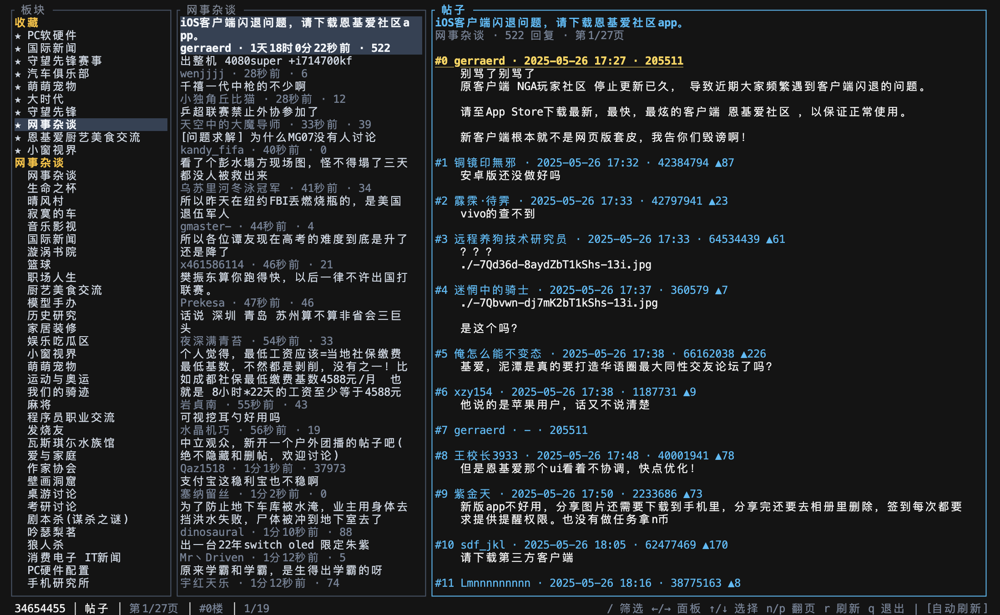

# rNGA

A Rust client for the NGA (艾泽拉斯国家地理) forum.

<p align="center">
  
</p>

## Crates

| Crate | Role |
|-------|------|
| [`rNGA`](./rNGA) | Library (`rnga`) |
| [`rNGA-CLI`](./rNGA-CLI) | CLI, TUI, MCP server (`rnga`) |

## Quick start

```bash
cargo install --path rNGA-CLI
rnga auth login --token YOUR_TOKEN --uid YOUR_UID   # optional
rnga forum list
rnga topic list 310
rnga topic read 12345678
rnga tui --forum 7                                  # interactive UI
```

Library usage:

```rust
use rnga::{NGAClient, Result, ForumIdKind};

#[tokio::main]
async fn main() -> Result<()> {
    let client = NGAClient::builder().build()?;
    let categories = client.forums().list().await?;
    let topics = client.topics().list(ForumIdKind::fid("310")).send().await?;
    Ok(())
}
```

## Documentation

| Doc | Contents |
|-----|----------|
| [rNGA/README.md](./rNGA/README.md) | Library API and examples |
| [rNGA-CLI/README.md](./rNGA-CLI/README.md) | CLI commands, TUI, MCP |
| [docs/NGA.md](./docs/NGA.md) | NGA HTTP protocol (implementation-independent) |
| [docs/CLIENT.md](./docs/CLIENT.md) | rNGA endpoint routing and format policy |

## Build

```bash
cargo build
cargo test
cargo build --release
```

## License

MIT
